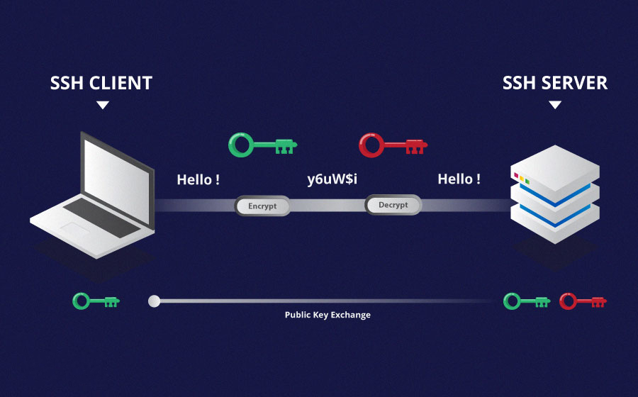
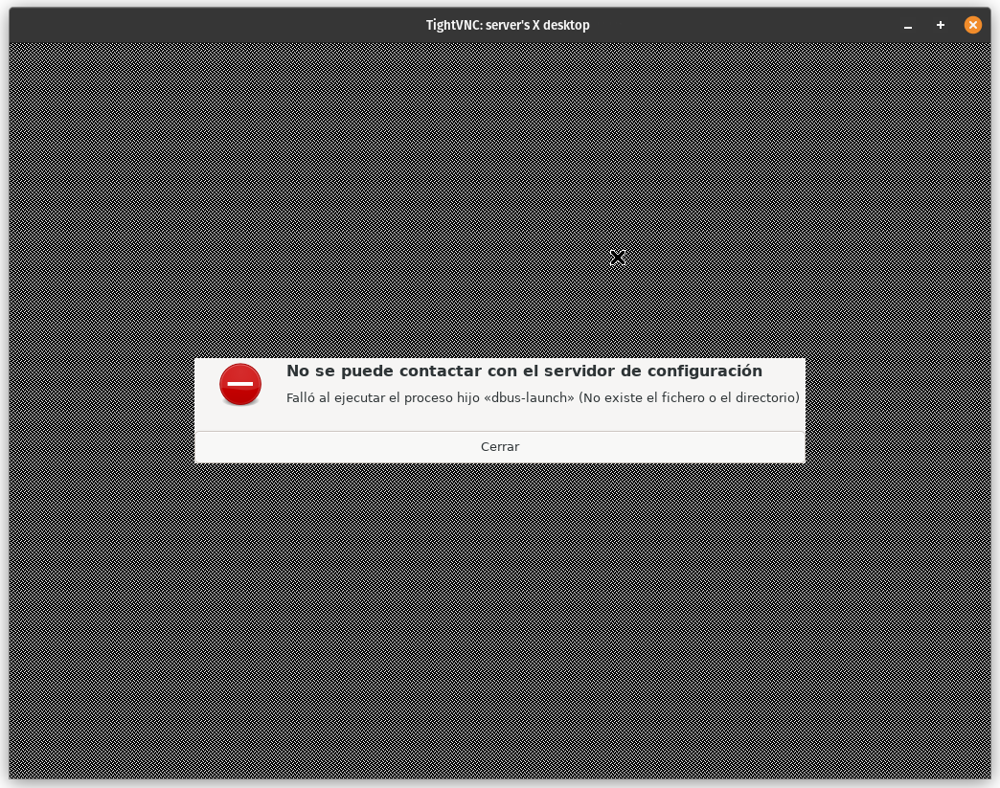

# Gestión remota con SSH y VNC

Esta sección incluye todas las cosas que hay que hacer en el servidor antes de poder guardarlo, olvidarte de él y no volver a necesitar enchufarle un monitor y un teclado para gestionarlo.

## Breve introducción

Un servidor es un ordenador al que no quieres tenerle conectado ni un monitor ni un teclado _(el ratón no existe)_ porque no deberías tener que tocarlo directamente salvo para el mantenimiento físico y cambios en la BIOS o en el sistema operativo.

Pero sí que hay que conectarse a él habitualmente para instalar y desinstalar software y para configurarlo. Esto lo haremos desde otro dispositivo usando el protocolo _Secure Shell (SSH)_, que nos permitirá ejecutar comandos en el servidor, transferir archivos y otras cosas más chulas que veremos después. Todo ello con una conexión cifrada :D

Es aquí donde se nos plantea un gran problema: Cuando nos podemos conectar al servidor mediante SSH es cuando está encendido _(y con los discos desencriptados)_, pero ¿y si no estamos en casa y el ordenador se ha tenido que reiniciar o ha habido un apagón? Entonces el ordenador se quedaría esperando a que pusiéramos _(¡con un teclado!)_ la contraseña para desencriptar los discos y así poder seguir encendiéndose. Eso no mola. Deberíamos de poder desencriptar el ordenador remotamente también para no tener miedo.

Este problema lo resolveremos tras preparar el servidor para el uso habitual.

::: warning ADVERTENCIA
Aunque estoy seguro de que es por culpa del router que usamos. En nuestro caso, si el servidor no tiene ningún tipo de interacción a través de internet durante unos minutos, el router deja de permitir conexiones a él. Para ahorrarnos el disgusto de intentar conectarnos y descubrir que el router no nos lo va a permitir porque el servidor haya estado "inactivo", tendremos que forzar una actividad periódica mínima (como hacer un ping) tanto cuando el ordenador esté encendido como cuando esté esperando a que se introduzca la contraseña para desencriptar los discos.
:::

## Uso habitual

Vamos a empezar dejando lista nuestra vía para poder gestionar remotamente el servidor cuando esté encendido.

Como lo elegimos a la hora de instalar Debian, el servidor ya viene con OpenSSH Server instalado, que por defecto se ejecuta en el puerto `22`.

::: warning ADVERTENCIA
Es recomendable no usar el puerto 22 para SSH, porque, al ser el puerto por defecto, muchos ataques automatizados solo intentan conectarse a ese puerto, así que cambiándolo a otro nos ahorraremos posibles problemas. Quien quiera averiguar en qué puerto tienes el SSH podrá hacerlo con un escaneo de puertos igualmente, pero ya tendrá que querer atacarte a ti en concreto.
:::

Sin embargo, si intentamos conectarnos desde otro ordenador, no nos dejará, por dos motivos:

- Tenemos que abrir el puerto en el router.
- Tenemos que permitirlo en el firewall _(si tenemos)_.

Así que lo que hay que hacer es primero abrir el puerto SSH en el router y, si tenemos un firewall, permitirlo también. **Si no tenemos un firewall, vamos a instalarlo porque es necesario.** Para ello ejecutamos los siguientes comandos:

```sh
sudo apt install ufw
sudo ufw allow 22/tcp
sudo ufw enable
```

Donde `22` es el puerto de SSH y `tcp` el protocolo, que puedes leer [aquí](https://nordvpn.com/es/blog/protocolo-tcp-udp/) las diferencias entre el protocolo TCP y el UDP. Con esto ya tenemos el firewall configurado para aceptar conexiones SSH.

Ahora ya podríamos conectarnos al servidor desde otro ordenador, pero tendría que ser con la contraseña del usuario administrador, cosa que es poco segura, así que vamos a utilizar la autenticación por claves SSH.



Para configurarlo en el ordenador del que nos vayamos a conectar, seguiremos [este tutorial](https://www.digitalocean.com/community/tutorials/how-to-configure-ssh-key-based-authentication-on-a-linux-server). Además, tiene al final una parte de configuración que también se debe hacer y viene incluido más adelante en la guía.

## Reinicios y desencriptación del disco

Para solucionar el problema que planteamos antes, existe un paquete de Debian llamado `dropbear-initramfs` que nos va a permitir hacer justo lo que queremos. **¿Qué es lo que hace?** Pues para eso hay que entender un poco cómo se enciende un ordenador con Linux y los discos encriptados.

El disco duro realmente no está encriptado del todo, tiene una partición llamada boot que únicamente contiene la información necesaria para decirle al ordenador cuando se intenta encender cómo debe hacerlo. Aquí entra el sistema `initrd`, que son los archivos básicos que se cargan en la RAM cuando el ordenador se enciende y que, junto con el kernel de Linux, se ocupan de gestionar el encendido. Puedes ver una descripción más detallada en [esta página](https://wiki.ubuntu.com/Initramfs).

Teniendo en cuenta lo anterior, `dropbear-initramfs` es un software que permite que el servidor reciba conexiones SSH en esta fase del encendido, justo a tiempo para poner la contraseña para desencriptar los discos.

Instalarlo es muy sencillo, solo hay que irse a la terminal del servidor e instalarlo como un paquete normal y corriente escribiendo

```sh
sudo apt install dropbear-initramfs
```

**¿Eso es todo?** Obviamente no, hay que configurarlo.

Vamos a editar el archivo de configuración, que está en `/etc/dropbear/initramfs/dropbear.conf` y vamos a descomentar y editar la línea:

```ssh-config
DROPBEAR_OPTIONS="-I 300 -j -k -p 22 -s"
```

¿Qué significa esto?

- `-i 300` desconecta a quien en 300 segundos no ha realizado ninguna acción.
- `-j` deshabilita la redirección de puertos locales.
- `-k` deshabilita la redirección de puertos remotos.
- `-p 22` indica que se ejecute en el puerto 22.
- `-s` deshabilita la autenticación por contraseña.

Como indica el último parámetro, la autenticación por contraseña está deshabilitada, así que utilizaremos también las claves públicas que hayamos autorizado para OpenSSH Server, podemos copiarlas y hacer que los cambios tengan efecto con los comandos:

```sh
$ sudo cp /home/admin/.ssh/authorized_keys /etc/dropbear-initramfs/etc/dropbear/initramfs/
$ sudo update-initramfs -u
```

Esto generará de nuevo en la partición `boot` los archivos de `initramfs` incluyendo los cambios que hemos hecho.

::: tip RELATO
Tras esto descubrí que si el ordenador permanecía mucho tiempo encendido sin que nadie se conectase para desencriptar los discos, dejaba de ser accesible a través de la IP pública o el dominio (aunque sí era posible acceder a través de la IP local). Al principio pensé que era porque había que configurar la IP fija en `initramfs`, pero al intentar hacerlo, como el router ya tenía fijada la IP, se hacían un lío y no funcionaba. Al final se solucionó al poner también ahí el dominio a actualizarse, que es justo lo que viene ahora en la guía.
:::

### ¿Y qué pasa con el dominio?

¿No podría ocurrir que, mientras el ordenador está esperando a que alguien se conecte para desencriptar los discos, la IP pública cambie? Pues sería raro, pero podría ocurrir. Y no nos conviene, así que vamos a prevenir que eso pueda ocurrir.

El objetivo es poner la tarea de `crontab` para ir actualizando la IP para que también se ejecute durante el encendido. El primer problema que nos encontramos para esto es que los comandos disponibles cuando estamos en `ìnitramfs` son muy pocos y no incluyen `crontab`. Concretamente, los comandos que hay disponibles son una versión reducida de [BusyBox](https://busybox.net/) y para poder usar `crontab` necesitamos la versión completa.

`initramfs` utiliza la versión de BusyBox que haya instalada en Debian, así que tenemos que cambiarla escribiendo `sudo apt install busybox-static`, que reemplazará a la anterior y se incluirá automáticamente en `initramfs`.

::: danger PELIGRO
Aunque seguramente no sea el caso, puede ser que al hacer esto se cree una incompatibilidad entre la nueva versión de BusyBox y el resto de componentes de `initramfs`, haciendo que el servidor no pueda encenderse, así que recomiendo hacer una copia de seguridad por si algo sale mal.
:::

Después de esto `crontab` ya estará disponible, pero no funcionará porque en `initramfs` el directorio donde se guarda por defecto el archivo con los comandos no existe. La forma de resolverlo es creando el archivo `/usr/share/initramfs-tools/hooks/crontab` con este contenido:

```sh
#!/bin/sh -e

if [ "$1" = "prereqs" ]; then exit 0; fi
. /usr/share/initramfs-tools/hook-functions

mkdir $DESTDIR/var
mkdir $DESTDIR/var/spool
mkdir $DESTDIR/var/spool/cron
mkdir $DESTDIR/var/spool/cron/crontabs
cp /var/spool/cron/crontabs/root $DESTDIR/var/spool/cron/crontabs/root
```

Escribimos `sudo chmod +x /usr/share/initramfs-tools/hooks/crontab` para hacer el archivo ejecutable y esto lo que hará es crear el directorio y copiar el mismo archivo que ya habíamos configurado antes con el comando para actualizar la IP. Cada vez que escribamos `sudo update-initramfs -u` se volverá a crear el directorio y a copiar el archivo, con lo que también nos aseguraremos de que si cambiamos el archivo también se cambiará en `initramfs`, aunque no inmediatamente.

Sin embargo, aunque ya podemos usar `crontab` en `initramfs`, nos falta hacer que se empiece a ejecutar, así que tenemos que crear otro archivo que se encargue de iniciar `crond`, que ejecutará lo que haya en `crontab`. Ese archivo será `/usr/share/initramfs-tools/scripts/init-premount/crond` y tendrá este contenido:

```sh
#!/bin/sh
# Start crond

PREREQ="busybox"
prereqs()
{
        echo "$PREREQ"
}

case $1 in
prereqs)
        prereqs
        exit 0
        ;;
esac

. /scripts/functions

crond -l 2

exit 0
```

Que no se nos olvide hacer el archivo ejecutable escribiendo `sudo chmod +x /usr/share/initramfs-tools/scripts/init-premount/crond` y ya podremos ir con el último paso para que todo esto funcione.

Nos queda una última cosa por hacer, y es que en `initramfs` no hay configurado un servidor DNS, así que el ordenador no podrá resolver `freedns.afraid.org` a la IP que apunte y no se podrá ejecutar el comando. Un apaño para que funcione es cambiar el contenido de `crontab` escribiendo `sudo crontab -e` a este:

```nginx
#
# To define the time you can provide concrete values for
# minute (m), hour (h), day of month (dom), month (mon),
# and day of week (dow) or use '*' in these fields (for 'any').
#
# Notice that tasks will be started based on the cron's system
# daemon's notion of time and timezones.
#
# Output of the crontab jobs (including errors) is sent through
# email to the user the crontab file belongs to (unless redirected).
#
# For example, you can run a backup of all your user accounts
# at 5 a.m every week with:
# 0 5 * * 1 tar -zcf /var/backups/home.tgz /home/
#
# For more information see the manual pages of crontab(5) and cron(8)
#
# m h  dom mon dow   command
1,6,11,16,21,26,31,36,41,46,51,56 * * * * sleep 46 ; wget --no-check-certificate -O - "https://$(nslookup freedns.afraid.org 1.1.1.1 | awk '/^Address: / { print $2 }')/dynamic/update.php?cosas" > /tmp/freedns_@_dominio_com.log 2>&1 &
```

Que lo que hace es resolver con otra herramienta de BusyBox, `nslookup`, el dominio `freedns.afraid.org` con los servidores de Cloudflare y ya después ejecutar el resto del comando.

Ejecutamos una última vez `sudo update-initramfs -u` y ya estaría.

## Resolviendo problemas

Un problema con el que nos encontramos cuando intentamos conectarnos al servidor por SSH primero para desencriptar los discos y después para el uso normal, es que nos salta este error tras escribir `ssh admin@wupp.dev`:

```
@@@@@@@@@@@@@@@@@@@@@@@@@@@@@@@@@@@@@@@@@@@@@@@@@@@@@@@@@@@
@    WARNING: REMOTE HOST IDENTIFICATION HAS CHANGED!     @
@@@@@@@@@@@@@@@@@@@@@@@@@@@@@@@@@@@@@@@@@@@@@@@@@@@@@@@@@@@
IT IS POSSIBLE THAT SOMEONE IS DOING SOMETHING NASTY!
Someone could be eavesdropping on you right now (man-in-the-middle attack)!
It is also possible that a host key has just been changed.
The fingerprint for the ED25519 key sent by the remote host is
SHA256:I9TWN1skf97h/X9sJgevzZT1kZZQ9hFRQadccKljr7I.
Please contact your system administrator.
Add correct host key in /home/user/.ssh/known_hosts to get rid of this message.
Offending ECDSA key in /home/user/.ssh/known_hosts:2
  remove with:
  ssh-keygen -f "/home/user/.ssh/known_hosts" -R "wupp.dev"
Host key for wupp.dev has changed and you have requested strict checking.
Host key verification failed.
```

¿Qué es lo que ocurre? Pues que la IP a la que nos estamos conectando es la misma pero las claves públicas del servidor, que son las que se utilizan para verificar su identidad, son distintas. Esto el ordenador lo confunde _(por precaución)_ con un intento de suplantación de la identidad del servidor, cosa que sería muy peligrosa en caso de ser cierta. Por eso no nos deja conectarnos.

Para que nos deje conectarnos es tan sencillo como eliminar el archivo de `known_hosts` mencionado en el error, pero entonces cada vez que reiniciásemos el servidor tendríamos que estar eliminando ese archivo para poder conectarnos de nuevo y, si de verdad estuviesen intentando suplantar la identidad del servidor, no nos enteraríamos.

Por suerte, hay un apaño. Si ponemos Dropbear y OpenSSH Server en puertos distintos en el servidor, podemos utilizar una identidad distinta para cada puerto cuando nos conectemos.

::: danger PELIGRO
Una solución que se nos podría ocurrir es utilizar la misma clave pública y privada para Dropbear y para OpenSSH Server. Esto es una malísima idea porque la clave privada de OpenSSH Server es algo que quieres proteger más que a tu gato y, por otro lado, la de Dropbear se va a guardar en una parte desencriptada del sistema operativo, porque necesita usarse antes de desencriptar los discos, así que no está muy protegida.
:::

Lo primero para esto es utilizar un puerto distinto para OpenSSH Server al que usamos para Dropbear. Para ello, editamos el archivo `/etc/ssh/sshd_config` y descomentamos la línea `#Port 22` y cambiamos el número, quedando por ejemplo `Port 2222`.

Antes de reiniciar el servidor SSH, debemos asegurarnos de que:

- El nuevo puerto está abierto en el router.
- El nuevo puerto está permitido por el firewall, en el caso de UFW: `sudo ufw allow 2222/tcp`.

_Nuevamente el puerto es de ejemplo y es recomendable cambiarlo a otro._

Por último, reiniciamos el servidor SSH para que los cambios tengan efecto:

```sh
sudo systemctl restart ssh
```

::: tip RELATO
Iván mientras escribía esto _(desde un sitio lejano a la ubicación del servidor)_ se olvidó de permitir el nuevo puerto en el firewall y pasaron cosas malas, si quieres leer la historia completa puedes hacerlo [aquí](../relatos/bloqueo-ssh).
:::

A partir de ahora ya no deberíamos tener el problema al conectarnos, lo único que hay que tener en cuenta es que, a la hora de establecer la conexión SSH, tendremos que indicar el puerto:

```sh
ssh -p 2222 admin@wupp.dev
```

## Reforzando la seguridad

Todavía tenemos que desactivar el acceso con usuario y contraseña por SSH, que es muy poco seguro, para solo permitir el acceso con las claves públicas permitidas. Vamos a editar el archivo `/etc/ssh/sshd_config` y a cambiar las siguientes líneas:

```ssh-config
PasswordAuthentication no
PermitRootLogin no
AllowUsers admin
X11Forwarding no
```

Las líneas estarán en distintos sitios del archivo de configuración, solo hay que descomentarlas y editarlas. Además, en nuestro caso no aparecía la línea de `AllowUsers` para permitir la conexión solamente hacia ese usuario, así que la añadimos en cualquier parte del archivo. ¿Qué significa cada línea?

- `PasswordAuthentication no` prohíbe los accesos con contraseña, pudiendo ser únicamente con clave pública.
- `PermitRootLogin no` evita que se pueda acceder directamente al usuario `root`.
- `AllowUsers admin` es opcional pero recomendable, restringe los usuarios a los que se puede acceder directamente, se pueden poner varios separándolos por espacios.
- `X11Forwarding no` evita que se puedan ejecutar aplicaciones gráficas de forma remota, pues es algo que en un principio no vamos a usar.

::: warning ADVERTENCIA
Antes de hacer efectivos los cambios, tenemos que asegurarnos de que existe el archivo `/home/admin/.ssh/authorized_keys` y que tiene las claves públicas de los dispositivos desde los que nos queramos conectar al servidor, porque si no están no podremos conectarnos.
:::

Por último, hacemos efectivos los cambios:

```sh
sudo systemctl restart ssh
```

Y ya deberíamos de poder conectarnos sin que nos pida la contraseña del usuario `admin`.

## Virtual Network Computing (VNC)

¿Qué mierdas es un VNC? Pues básicamente un entorno gráfico de escritorio remoto. Se utiliza para controlar remotamente otros ordenadores con un escritorio como si fuese realmente tu propio ordenador. ¿No acabamos de desactivar eso en la configuración del servidor SSH? Pues sí, pero vamos a usarlo de otra forma que es más segura y no necesita esa opción activada.

Hemos seguido [este tutorial](https://www.digitalocean.com/community/tutorials/how-to-install-and-configure-vnc-on-debian-10).

Como detalles, no hemos establecido una contraseña para solo vista.

Aquí da igual cambiar o no el puerto por defecto, ya que no estará expuesto directamente a internet.

En nuestro ordenador podemos instalar `xtightvncviewer` para conectarnos. Solo tendremos que conectarnos mediante SSH al servidor indicando que queremos redirigir el puerto 5901 de nuestro ordenador al 5901 del del servidor. Esto lo podemos hacer con `ssh -L 5901:127.0.0.1:5901 admin@wupp.dev`. Una vez estemos conectados, podemos ejecutar `xtightvncviewer` desde la terminal, conectarnos a `localhost:5901` y poner la contraseña del VNC.

En nuestro caso, al intentar conectarnos nos encontramos con el siguiente error:



Por suerte, se solucionó instalando un paquete y reiniciando el servidor VNC:

```sh
sudo apt install dbus-x11
sudo systemctl restart vncserver@1
```

::: info
Es raro necesitar el servidor VNC, pero justo estoy escribiendo esta parte antes que la de configuración de servidor SSH porque necesito abrir unos puertos en el router y para eso necesito acceder con un navegador desde el servidor.
Como era de esperar, Debian no venía con navegador instalado, así que para poder usar uno con el VNC instalamos Firefox con `sudo apt install firefox-esr`.
:::

## Embelleciendo

Cuando iniciamos sesión por SSH nos aparece un mensaje como este:

```
Linux server 5.10.0-21-amd64 #1 SMP Debian 5.10.162-1 (2023-01-21) x86_64

The programs included with the Debian GNU/Linux system are free software;
the exact distribution terms for each program are described in the
individual files in /usr/share/doc/*/copyright.

Debian GNU/Linux comes with ABSOLUTELY NO WARRANTY, to the extent
permitted by applicable law.
Last login: Mon May 24 01:23:45 2032 from 192.168.1.1
```

Que no es muy bonito la verdad, así que podemos hacer unos cambios para que quede un mensaje mucho más lindo.

1. Editamos `/etc/ssh/sshd_config` para poner los siguientes ajustes:

```ssh-config
PrintMotd no
PrintLastLog no
Banner none
```

2. Quitamos el resto del mensaje de bienvenida con `sudo truncate -s 0 /etc/motd`.
3. Editamos `/etc/pam.d/sshd` para asegurarnos de que las siguientes líneas están comentadas:

```nginx
# Print the message of the day upon successful login.
# This includes a dynamically generated part from /run/motd.dynamic
# and a static (admin-editable) part from /etc/motd.
#session    optional     pam_motd.so  motd=/run/motd.dynamic
#session    optional     pam_motd.so noupdate

# Print the status of the user's mailbox upon successful login.
#session    optional     pam_mail.so standard noenv # [1]
```

4. Instalamos `figlet` y `lolcat` para tener colores y cabeceras personalizadas `sudo apt update && sudo apt install figlet lolcat`.
5. Creamos el archivo `~/welcome_message.sh`:

```sh
#!/bin/bash

# Cabecera personalizada
echo "WUPP . DEV" | figlet | lolcat

# Última conexión
last_login=$(last -i -F $USER | head -n 2 | tail -n 1)
login_time=$(echo $last_login | awk '{print $5 " " $6 " " $7 " " $8}')
echo -e "\e[1;33mÚltima conexión:\e[0m" $login_time

# Información del uso del sistema
echo -e "\e[1;33mUso del CPU:\e[0m" $(grep 'cpu ' /proc/stat | awk '{usage=($2+$4)*100/($2+$4+$5)} END {print usage "%"}')
echo -e "\e[1;33mUso de memoria:\e[0m" $(free -m | awk 'NR==2{printf "%.2f%%\t\t", $3*100/$2 }')

# Espacio en disco
echo -e "\e[1;33mEspacio en disco:\e[0m"
df -h | grep -vE '^tmpfs|udev' | awk '{print $1 "\t" $5 "\t" $6}' | column -t | lolcat

echo ""

```

6. Hacemos el archivo ejecutable `chmod +x ~/welcome_message.sh` y lo añadimos a `~/.bashrc`:

```sh
# ~/.bashrc: executed by bash(1) for non-login shells.
# see /usr/share/doc/bash/examples/startup-files (in the package bash-doc)
# for examples

# ...

# Add the welcome message
~/welcome_message.sh
```

7. Reiniciamos el servicio de SSH `sudo systemctl restart ssh`, nos desconectamos y nos volvemos a conectar para comprobar que funciona.
