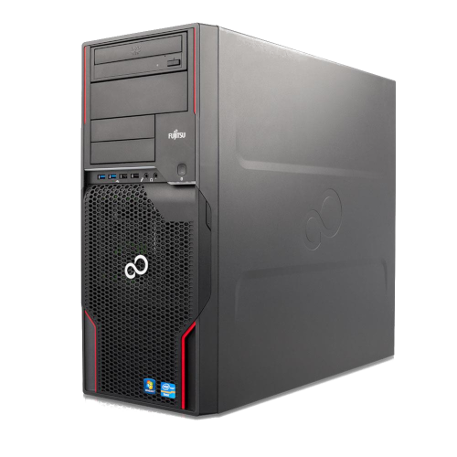
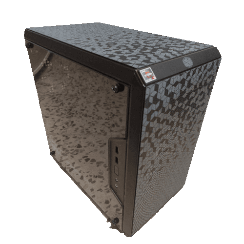
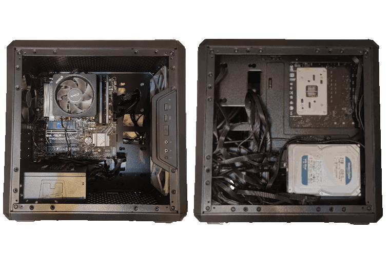

# Historia del servidor

Al principio de todo, concretamente en abril de 2020, lo único que había de servidor era una torre **Fujitsu CELSIUS W520** que estaba a la venta en Ebay por 200€. Se compró con el único objetivo de montar un servidor de Minecraft que pudiera estar activo las 24 horas del día.

Esa torre contaba únicamente con un disco duro mecánico de **1TB** a **7200 RPM**, pero en mayo de 2022 se actualizó a:

- Un disco duro **SSD SATA de 480GB** para almacenar el sistema operativo y el servidor de Minecraft, ya que en los foros dicen que mejora mucho el rendimiento del mundo.
- El disco duro inicial de **1TB** para guardar copias de seguridad tanto del sistema como del servidor de Minecraft.
- Otro disco duro mecánico de **4TB WD Red Plus de 5400 RPM** para almacenar todos los demás archivos: _Correo, Nextcloud, páginas web (incluyendo los mapas de Minecraft)..._

Esto también coincidió con cuando Lucas se unió con sus quejas sobre que usara Ubuntu Server y, aprovechando que con el cambio de discos habría que reinstalar el sistema operativo, pusimos Debian.

En cuanto al resto de especificaciones, no han cambiado, así que se encuentran en el apartado de [hardware](./hardware).

Las cosas siguieron tranquilamente hasta julio de 2023, cuando decidimos dar un gran salto y comprar un nuevo servidor, con componentes de última generación, para dedicarlo exclusivamente al Minecraft. Esto nos aseguraría una calidad de rendimiento mucho mayor.

Esta otra torre la montamos comprando los componentes por piezas.

Ambos servidores están conectados por cable a un switch. Antes teníamos el [TP-Link TL-SG1005D](https://www.tp-link.com/es/home-networking/soho-switch/tl-sg1005d/), pero, tras el [gran apagón del 28 de abril de 2025](https://es.wikipedia.org/wiki/Apag%C3%B3n_en_la_pen%C3%ADnsula_ib%C3%A9rica_de_2025), empezó a dejar de funcionar durante breves periodos de tiempo hasta que finalmente murió el 16 de mayo de 2025.
