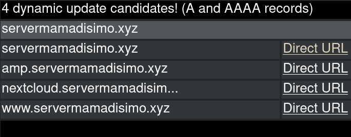

# Configuración del router y del dominio

Aquí nuestro objetivo será no tener que preocuparnos de nada que no sea el propio servidor. Para ello, hay que preocuparse momentáneamente de dos elementos externos:
- Configurar el router de tu casa para que deje que el servidor sea un servidor.
- Adquirir un dominio para que sea más cómodo conectarte al servidor y despreocuparte de cambios de la IP pública.

## Breve introducción sobre las IPs

Aquí vamos a hablar de dos tipos de IPs:
- **IP Pública:** Esta es la IP con la que se puede acceder al servidor *(o cualquier otro dispositivo de tu red, si lo permites)* desde cualquier parte de internet.
- **IP Local:** Esta IP identifica al sevidor dentro de la red a la que está conectado, pero no sirve fuera.


Por desgracia, seguimos usando para ambos casos IPv4, pero bueno, menos da una piedra.

Lo que nos interesa aquí es la IP pública. Cuando queramos conectarnos al servidor o alguien más quiera, queda feo que tengan que hacerlo con la IP. Aquí es donde entran los **dominios**.

## Dominio, ¿qué es y para qué sirve?

Un dominio es un pseudónimo para la IP, que es más bonito y fácil de recordar que la propia IP. Cuando nos conectamos a cualquier web, lo hacemos mediante el *Uniform Resource Locator (URL)*, que se divide en:


En nuestro caso, el dominio es `servermamadisimo.xyz`, y cuando te intentas conectar a esa dirección, el ordenador le pregunta qué IP es a la que apunta la dirección a unos servidoes especiales que se llaman *nameservers*. Estos servidores son una parte fundamental del DNS *(Domain Name System)*, que permite utilizar las direcciones en vez de las IPs. Normalmente los servidores DNS que se usan son los del propio proveedor de internet, pero se pueden cambiar para que sean a otros como [NextDNS](https://my.nextdns.io).

Los dominios **hay que pagarlos**, esta es la parte mala. Los más baratos suelen estar entre 10€ y 15€ anuales, aunque el primer año suele costar menos.

Una vez compras un dominio, puedes elegir a qué IP apunta e incluso puedes crear **subdominios**.

### ¿Qué son los subdominios?

Pues lo que va antes del dominio claro, por ejemplo, para `servermamadisimo.xyz` podemos crear los subdominios `www.servermamadisimo.xyz`, `mc.servermamadisimo.xyz` o `nextcloud.servermamadisimo.xyz`. Esto es útil para separar los servcios que tienes en el servidor. Además, te permite apuntar a distintas IPs o incluso hacer redirecciones para cada subdominio.

Pero el hecho de tener un dominio no solo ayuda a la comodidad de recordarlo y escribirlo, a parte de que es necesario para poder usar subdominios, también nos permite no preocuparnos de qué pasa si la IP pública del servidor cambia *(que puede ocurrir)*, solo tienes que decirle al dominio que señale a la nueva IP. De no tener un dominio, tendrías que decirle a todas las personas que se conectan al servidor la nueva IP para que la cambien.

### Adquiriendo el dominio

Para comprar un dominio, primero debes buscar un proveedor, hay muchas elecciones. La nuestra fue [OnlyDomains](https://www.onlydomains.com/account/login), aunque [Namecheap](https://www.namecheap.com/) también puede ser una buena opción. Después, tendrás que pensar en qué nombre quieres para tu dominio y comprobar que esté disponible.

Una cosa muy importante a la hora de registrar un dominio es tener la protección **Whois**, porque así evitará que cualquiera que busque quién ha registrado el dominio pueda saber tus datos personales como el número de teléfono y el correo electrónico. Puede llegarte mucho spam por no tener esta protección. Por suerte, suele costar poco o incluso estar incluído con el pago del dominio, como es nuestro caso.

### Utilizando otros nameservers

Cada dominio está asociado a unos nameservers, que serán los que digan a qué IP apunta el dominio y cada subdominio que haya.

Por defecto, los proveedores de dominios suelen usar sus propios nameservers, pero puedes configurar tu dominio para que use otros. Eso es básicamente como darle el control del dominio a otra página en vez de la página en la que has comprado el dominio. **¿Por qué querrías hacer esto?** Pues porque hay páginas como [FreeDNS](https://freedns.afraid.org/) que te dan muchas facilidades para gestionar tu dominio y para actualizar la IP pública de tu servidor en el dominio si cambia. Esto OnlyDomains, por ejemplo, no lo permite de una forma sencilla, por eso nosotros usamos los nameservers de FreeDNS en vez de los propios de OnlyDomains.

::: warning ADVERTENCIA
Cambiar los nameservers de tu dominio puede tardar hasta 24 horas en hacerse efectivo en todo el mundo, hazlo solo si es necesario y tienes tiempo para esperar.
:::

Así se ven los nameservers de nuestro dominio al cambiarlos a FreeDNS:


## Actualizando la IP pública en el domino automáticamente

FreeDNS nos permite gestionar todos los subdominios y actualizar la IP a la que apuntan símplemente con un enlace, que debemos abrir desde el servidor. Esto hará que dejempos de preocuparnos por si estamos fuera de casa y de repente nuestra IP pública cambia, ya que si no se actualizara automáticamente, perderíamos acceso al servidor a través del dominio y para poder conectarnos tendríamos que averiguar la nueva IP pública, cosa que no es precisamente sencilla.

Teniendo una cuenta de FreDNS y el dominio con sus nameservers, podemos ir al apartado de **Dynamic DNS** y copiar la **Direct URL** para actualizar la IP de nuestro dominio.

En este caso cualesquiera de las URLs nos serviría, ya que tanto el dominio como los subdominios apuntan a la misma IP y está activada la opción **Link updates of the same IP together**, haciendo que al actualizar un dominio o subdominio, se actualicen los demás que aputaban a la misma IP.

Vayamos al servidor. Debemos tener installado `crontab`, un software para ejecutar tareas cada cierto tiempo. Escribimos `sudo crontab -e` *(importante el sudo)* y el archivo debería quedar más o menos así:

```bash
# 
# To define the time you can provide concrete values for
# minute (m), hour (h), day of month (dom), month (mon),
# and day of week (dow) or use '*' in these fields (for 'any').
# 
# Notice that tasks will be started based on the cron's system
# daemon's notion of time and timezones.
# 
# Output of the crontab jobs (including errors) is sent through
# email to the user the crontab file belongs to (unless redirected).
# 
# For example, you can run a backup of all your user accounts
# at 5 a.m every week with:
# 0 5 * * 1 tar -zcf /var/backups/home.tgz /home/
# 
# For more information see the manual pages of crontab(5) and cron(8)
# 
# m h  dom mon dow   command
1,6,11,16,21,26,31,36,41,46,51,56 * * * * sleep 46 ; wget --no-check-certificate -O - UpdateURL >> /tmp/freedns_@_dominio_com.log 2>&1 &
```

Donde `UpdateURL` es la URL copiada de FreeDNS, que se verá como `https://freedns.afraid.org/dynamic/update.php?cosas` y `dominio_com` es el dominio, que en nuestro caso sería `servermamadisimo_xyz`.

Esto hará que cada 5 minutos se compruebe si la IP pública del servidor ha cambiado y, si es así, se actualizará a la nueva. Además, el resultado se guarda en un archivo temporal en `/tmp/freedns_@_domino_com.log`.

## Toqueteando en el router

Muy bien, ya tenemos el dominio apuntando a la IP pública de nuestro router y al servidor actualizándola si esta cambia. Pero queda todavía un problema externo al servidor que resolver.

Por defecto, el router no deja que alguien se conecte mediante la IP pública a algún dispositivo de la red porque es algo que solo debería ocurrir si estamos ofreciendo un servicio a través de internet.

### Breve introdución sobre los puertos

Para que varios programas puedan conectarse a internet y hacer cosas distintas simultáneamente es necesario el uso de puertos. Los puertos son puntos de transmisión y recepción de datos, están numerados del 1 al 65535 y algunos de ellos están reservados para un uso específico, por ejemplo:
- Los puertos 20 y 21 se utilizan para transferencia de archivos.
- El puerto 22 se utilia para las conexiones de *Secure Shell* *(SSH)* de las que hablaremos en la siguiente sección.
- El puerto 80 se utiliza para las conexiones de *Hypertext Transfer Protocol* *(HTTP)*, que es el protocolo por el que funcionan las páginas web.
- El puerto 123 se utiliza para el Network Time Protocol *(NTP)* para que los relojes de los ordenadoes estén sincronizados.
- El puerto 443 se utiliza para las conexiones *HTTP Secure* *(HTTPS)*, actuando como sustituto del puerto *HTTP*, ya que todas las conexiones deberían ir cifradas.
- El puerto 25565 es el más común para los servidores de Minecraft.

Pues bien, por defecto estos puertos no están abiertos para que un dispositivo cualquiera de internet pueda llegar y conectarse a nuestro ordenador a través de ellos. Esto está bien, porque, a no ser que tengas un servidor en tu casa, si alguien intenta conectarse a alguno de los puertos de tu ordenador no suele ser con buenas intenciones.

En nuestro caso, como tenemos un servidor, sí que necesitamos que los puertos estén abiertos, así que debemos configurar el router para que permita conexiones externas a los puertos que digamos.

::: info
Esto no quiere decir que de aquí en adelante cualquier persona se vaya a poder conectar a los puertos que quiera de cualquier dispositivo de tu red. Normalmente el router permite abrir los puertos solo para una IP local *(que en este caso será nuestro servidor)*, siguiendo cerrados para los demás dispositivos. Además, los ordenadores y teléfonos suelen venir con un firewall instalado, que también bloquea por defecto las conexiones externas en cualquier puerto. De hecho, tendremos que vérnolas también con el firewall del servidor aunque los puertos estén abiertos desde el router.
:::

### Abriendo puertos en el router (tengo que poner imágenes)

Lo primero es saber si tú desde tu casa puedes configurar tu router o debes contactar con el proveedor de internet para que lo haga, aunque lo más común es que sí puedas configurarlo.

Para configurarlo tienes que conectarte a la IP de la puerta de enlace del router, que suele ser `192.168.1.1`. Puedes conectarte simplemente abriendo el navegador y poniendo la IP en la barra superior como si de una URL se tratara.

Una vez conectado, te pedirá un nombre de usuario y una contraseña, que deberían estar escritos en el router *(no estaría mal cambiar la contraseña después de abrir los puertos)*.

::: warning ADVERTENCIA
Hay proveedores de internet como Digi, que te permiten configurar el router, pero los cambios que le hagas a los puertos no van a funcionar a no ser que contactes con ellos y les pidas que te permitan abrir puertos *(cosa por la que te cobrarán 1€ más al mes)*.
:::

*Cuando pueda poner imágenes de la interfaz terminaré esta parte porque lo único que tengo que decir es que hay que abrir los puertos que vayas a usar como 80, 443, 25565, etc y abrirlos para conexiones TCP y UDP en la IP local del servidor.*

**IMPORTANTE DEJAR FIJA LA IP LOCAL DEL SERVIDOR**