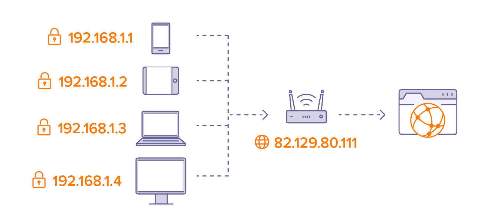
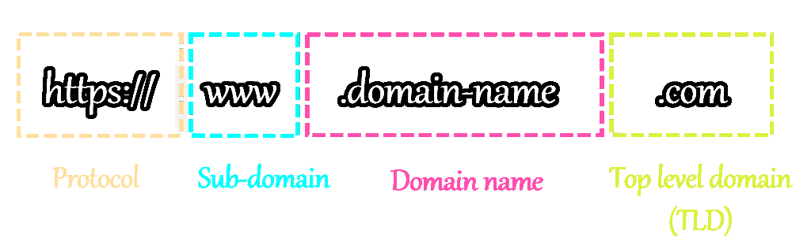
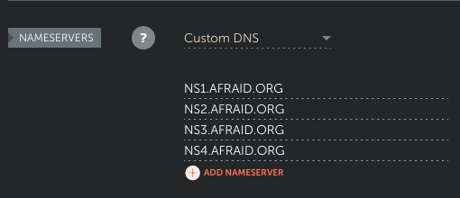
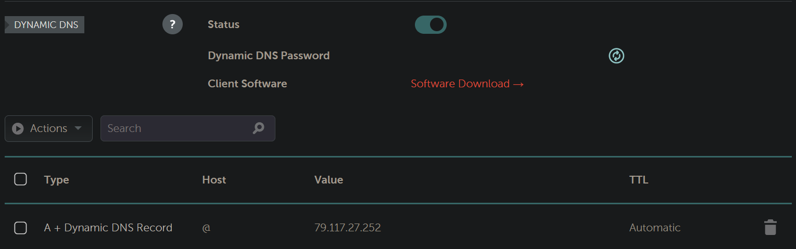
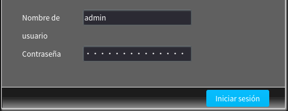
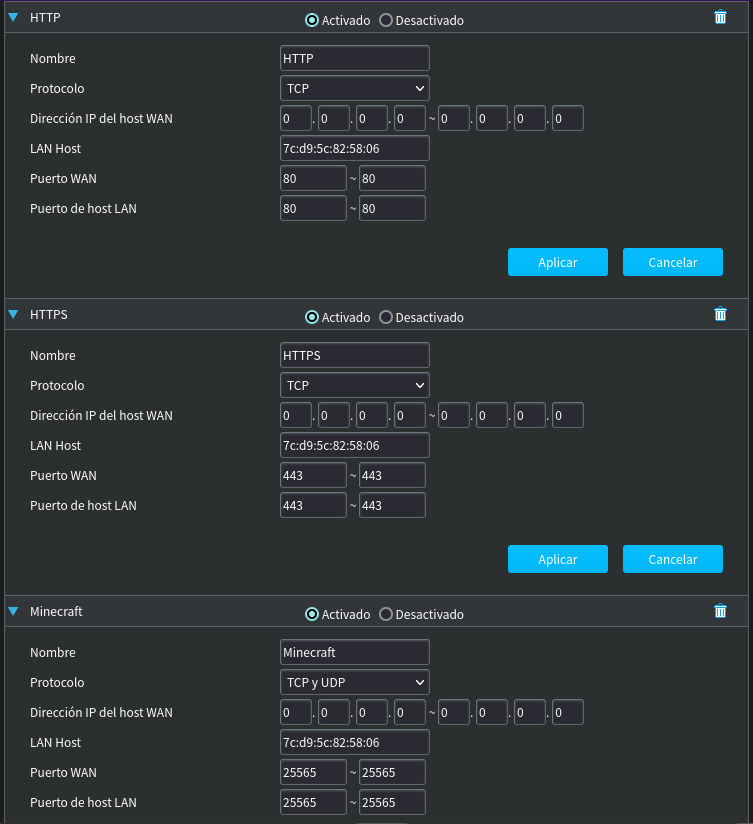

# Configuración del router y del dominio

Aquí nuestro objetivo será no tener que preocuparnos de nada que no sea el propio servidor. Para ello, hay que preocuparse momentáneamente de dos elementos externos:
- Configurar el router de tu casa para que deje que el servidor sea un servidor.
- Adquirir un dominio para que sea más cómodo conectarte al servidor y poder usar subdominios.

## Breve introducción sobre las IPs

Aquí vamos a hablar de dos tipos de IPs:
- **IP Pública:** Esta es la IP con la que se puede acceder al servidor *(o cualquier otro dispositivo de tu red, si lo permites)* desde cualquier parte de internet.
- **IP Local:** Esta IP identifica al servidor dentro de la red a la que está conectado, pero no sirve fuera.



Por desgracia, seguimos usando para ambos casos IPv4, pero bueno, menos da una piedra.

Lo que nos interesa aquí es la IP pública. Cuando queramos conectarnos al servidor o alguien más quiera, queda feo que tengan que hacerlo con la IP. Aquí es donde entran los **dominios**.

## Dominio, ¿qué es y para qué sirve?

Un dominio es un pseudónimo para la IP, que es más bonito y fácil de recordar que la propia IP. Cuando nos conectamos a cualquier web, lo hacemos mediante el Uniform Resource Locator *(URL)*, que se divide en:



En nuestro caso, el dominio es `wupp.dev`, aunque antes era `servermamadisimo.xyz` y, cuando te intentas conectar a esa dirección, el ordenador le pregunta qué IP es a la que apunta la dirección a unos servidores especiales que se llaman nameservers. Estos servidores son una parte fundamental del DNS *(Domain Name System)*, que permite utilizar las direcciones en vez de las IPs. Normalmente los nameservers que se usan son los del propio proveedor de internet, pero se pueden cambiar para que sean a otros como [NextDNS](https://my.nextdns.io).

Los dominios **hay que pagarlos**, esta es la parte mala. Los más baratos suelen estar entre 10€ y 15€ anuales, aunque el primer año suele costar menos.

Una vez compras un dominio, puedes elegir a qué IP apunta e incluso puedes crear **subdominios**.

### ¿Qué son los subdominios?

Pues lo que va antes del dominio claro, por ejemplo, para `wupp.dev` podemos crear los subdominios `www.wupp.dev`, `mc.wupp.dev` o `cloud.wupp.dev`. Esto es útil para separar los servicios que tienes en el servidor. Además, te permite apuntar a distintas IPs o incluso hacer redirecciones para cada subdominio.

Pero el hecho de tener un dominio no solo ayuda a la comodidad de recordarlo y escribirlo; a parte de que es necesario para poder usar subdominios, también nos permite no preocuparnos de qué pasa si la IP pública del servidor cambia *(que puede ocurrir)*, solo tienes que decirle al dominio que señale a la nueva IP. De no tener un dominio, tendrías que decirle a todas las personas que se conectan al servidor la nueva IP para que la cambien.

### Adquiriendo el dominio

Para comprar un dominio, primero debes buscar un proveedor, hay muchas elecciones. La nuestra fue [OnlyDomains](https://www.onlydomains.com/account/login) para `servermamadisimo.xyz`, aunque después nos pasamos a [Namecheap](https://www.namecheap.com/) para `wupp.dev`. Después, tendrás que pensar en qué nombre quieres para tu dominio y comprobar que esté disponible.

Una cosa muy importante a la hora de registrar un dominio es tener la protección **Whois**, porque así evitará que cualquiera que busque quién ha registrado el dominio pueda saber tus datos personales como el número de teléfono y el correo electrónico. Puede llegarte mucho spam por no tener esta protección. Por suerte, suele costar poco o incluso estar incluido con el pago del dominio, como es nuestro caso.

### Utilizando otros nameservers

Cada dominio está asociado a unos nameservers, que serán los que digan a qué IP apunta el dominio y cada subdominio que haya.

Por defecto, los proveedores de dominios suelen usar sus propios nameservers, pero puedes configurar tu dominio para que use otros. Eso es básicamente como darle el control del dominio a otra página en vez de la página en la que has comprado el dominio. 

Al principio nosotros decidimos usar los nameservers de [FreeDNS](https://freedns.afraid.org/) porque nos resultaba más fácil actualizar la IP pública del servidor si cambiaba a través de un enlace. Esto OnlyDomains, por ejemplo, no lo permitía de una forma sencilla.

El problema que encontramos usando FreeDNS es que alcanzamos el límite de 26 subdominios y usando los nameservers de Namecheap el límite era mucho mayor, así que tuvimos que dejar de usarlo. Por suerte, Namecheap también ofrece la posibilidad de actualizar la IP pública del servidor si cambia a través de un enlace.

::: warning ADVERTENCIA
Cambiar los nameservers de tu dominio puede tardar hasta 24 horas en hacerse efectivo en todo el mundo, hazlo solo si es necesario y tienes tiempo para esperar.
:::

Así se ven los nameservers de nuestro dominio al cambiarlos a FreeDNS:


## Actualizando la IP pública en el dominio automáticamente

Lo más común en una casa es que la IP pública que tengamos asignada no sea fija y vaya cambiando con el tiempo. Esto es un problema porque el dominio apunta a la IP, pero si esta cambia quedará inservible y si estamos fuera de casa no tendremos forma de conectarnos al servidor sin saber la nueva IP. Para solucionar eso aprovecharemos que Namecheap nos ofrece la posibilidad de actualizar la IP del dominio (o de sus subdominios) a través de un enlace.

Para permitir que esto ocurra tenemos que utilizar el tipo especial de registro *A + Dynamic DNS Record* de Namecheap en el dominio y los subdominios.


Por desgracia, el cliente que tiene disponible Namecheap es solo para Windows, pero igualmente existe la posibilidad de utilizar un enlace para actualizar la IP. Aun así, no utilizaremos directamente el enlace, ya que podemos aprovecharnos de la existencia de scripts más elaborados que sirven para actualizar la IP en los dominios y subdominios de Namecheap. Concretamente usaremos [este](https://github.com/nickjer/namecheap-ddns).

Siguiendo su documentación vamos a instalarlo usando `cargo`, así que también tendremos que [instalar Rust](https://www.rust-lang.org/tools/install).

Una vez instalado Rust, ejecutamos `cargo install namecheap-ddns` y tendremos el ejecutable en `/home/admin/.cargo/bin/namecheap-ddns`.

Siguiendo nuevamente la documentación, vamos a crear un servicio de `systemd` para que se encargue de actualizar la IP del dominio y todos sus subdominios. Creamos el archivo `/etc/systemd/system/ddns-update.service`:

```
[Unit]
Description=Update DDNS records for Namecheap
After=network-online.target

[Service]
Type=simple
Environment=NAMECHEAP_DDNS_TOKEN=passwd
Environment=NAMECHEAP_DDNS_DOMAIN=wupp.dev
Environment=NAMECHEAP_DDNS_SUBDOMAIN=mc,www
ExecStart=/home/admin/.cargo/bin/namecheap-ddns
User=admin

[Install]
WantedBy=default.target
```

Ejecutamos `sudo chmod 600 /etc/systemd/system/ddns-update.service` y creamos el archivo `/etc/systemd/system/ddns-update.timer`:

```
[Unit]
Description=Run DDNS update every 15 minutes
Requires=ddns-update.service

[Timer]
Unit=ddns-update.service
OnUnitInactiveSec=15m
AccuracySec=1s

[Install]
WantedBy=timers.target
```

Y ejecutamos los siguientes comandos para ponerlo en funcionamiento y comprobar que todo va bien:

```sh
sudo systemctl daemon-reload
sudo systemctl start ddns-update.service ddns-update.timer
sudo journalctl -u ddns-update.service
```

## Toqueteando en el router

Muy bien, ya tenemos el dominio apuntando a la IP pública de nuestro router y al servidor actualizándola si esta cambia. Pero queda todavía un problema externo al servidor que resolver.

Por defecto, el router no deja que alguien se conecte mediante la IP pública a algún dispositivo de la red porque es algo que solo debería ocurrir si estamos ofreciendo un servicio a través de internet.

### Breve introducción sobre los puertos

Para que varios programas puedan conectarse a internet y hacer cosas distintas simultáneamente se utilizan los puertos. Los puertos son puntos de transmisión y recepción de datos *(no son nada físico, solo un número que ayuda a gestionar mejor las conexiones)*, están numerados del 0 al 65535 y algunos de ellos están reservados o son los más habituales para un uso específico, por ejemplo:
- Los puertos 20 y 21 se utilizan para transferencia de archivos.
- El puerto 22 se utiliza para las conexiones de Secure Shell *(SSH)* de las que hablaremos en la siguiente sección.
- El puerto 80 se utiliza para las conexiones de Hypertext Transfer Protocol *(HTTP)*, que es el protocolo por el que funcionan las páginas web.
- El puerto 123 se utiliza para el Network Time Protocol *(NTP)* para que los relojes de los ordenadores estén sincronizados.
- El puerto 443 se utiliza para las conexiones HTTP Secure *(HTTPS)*, actuando como sustituto del puerto *HTTP*, ya que todas las conexiones deberían ir cifradas.
- El puerto 25565 es el más común para los servidores de Minecraft.

**Nota:** Puedes ver los puertos mejor explicados [aquí](https://www.adslzone.net/como-se-hace/internet/abrir-puertos-router/).

Pues bien, por defecto estos puertos no están abiertos para que un dispositivo cualquiera de internet pueda llegar y conectarse a nuestro ordenador a través de ellos. Esto está bien, porque, a no ser que tengas un servidor en tu casa, si alguien intenta conectarse a alguno de los puertos de tu ordenador no suele ser con buenas intenciones.

En nuestro caso, como tenemos un servidor, sí que necesitamos que los puertos estén abiertos, así que debemos configurar el router para que permita conexiones externas a los puertos que digamos.

::: info
Esto no quiere decir que de aquí en adelante cualquier persona se vaya a poder conectar a los puertos que quiera de cualquier dispositivo de tu red. Normalmente el router permite abrir los puertos solo para una IP local *(que en este caso será nuestro servidor)*, siguiendo cerrados para los demás dispositivos. Además, los ordenadores y teléfonos suelen venir con un firewall instalado, que también bloquea por defecto las conexiones externas en cualquier puerto. De hecho, tendremos que vérnoslas también con el firewall del servidor aunque los puertos estén abiertos desde el router.
:::

### Abriendo puertos en el router

Lo primero es saber si tú desde tu casa puedes configurar tu router o debes contactar con el proveedor de internet para que lo haga, aunque lo más común es que sí puedas configurarlo.

**Nota:** Nuevamente, en [esta página](https://www.adslzone.net/como-se-hace/internet/abrir-puertos-router/) está mejor explicado cómo abrir los puertos.

Para configurarlo tienes que conectarte a la IP de la puerta de enlace del router, que suele ser `192.168.1.1`. Puedes conectarte simplemente abriendo el navegador y poniendo la IP en la barra superior como si de una URL se tratara.

Una vez conectado, te pedirá un nombre de usuario y una contraseña, que deberían estar escritos en el router *(no estaría mal cambiar la contraseña después de abrir los puertos)*.



::: warning ADVERTENCIA
Hay proveedores de internet como Digi, que te permiten configurar el router, pero los cambios que le hagas a los puertos no van a funcionar a no ser que contactes con ellos y les pidas que te permitan abrir puertos *(cosa por la que te cobrarán 1€ más al mes)*.
:::

Vamos a abrir los puertos necesarios, un ejemplo pueden ser los de HTTP, HTTPS, Minecraft y SSH, podemos abrirlos tanto para TCP como para UDP especificando la IP local del servidor o su dirección MAC para que se abran solo para el servidor y quedaría así:



Si, para abrir los puertos, eliges usar la IP local del servidor en vez de la dirección MAC, es importante que dejes fija esa IP local al servidor, ya sea desde la configuración del router o desde el propio servidor, porque si no, en algún momento cambiará y los puertos dejarán de estar abiertos para el servidor.