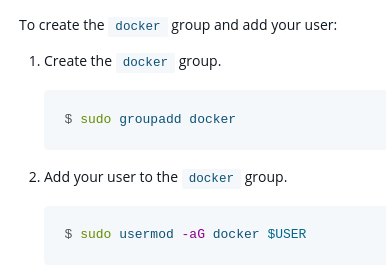

# Docker y sus cosas

Inicialmente, este relato viene de intentar instalar Docker que y Debian decidiese que no lo iba a hacer, pero tras una larga meditación y que Docker no funcione muchas veces porque porqué no, he decidido que puedo incluir aquí todas esas anécdotas de cuando Docker no es maravilloso.

## Instalación de Docker

Sorprendentemente, fué bien, sin problema.

## Vamos a crear el usuario _docker_

Aquí Debian dijo: ª.

Lo primero fué ejecutar `sudo adduser -m docker`, que es lo que indica cualquier guía para crear un usuario con Debian y otras distros y, hasta donde mi memoria llega, es el comando que había ejecutado yo previamente para esas tareas. Pero esta ejecución fallaba y decía lo siguiente: `Unknown option: m`. Viendo la ayuda del comando con `sudo adduser --help` y `man adduser`, pues no estaba la opción `-m`, entonces procedí a crearlo sin la opción a ver si funcionaba.

::: info
En un principio, la opción `-m` en `adduser` indica al comando que cree la carpeta _home_ del usuario en _/home/\<username>_ (o donde se indique con la opción `-D`).
:::

Al ejecutar `sudo adduser docker`, el comando fallaba y devolvía el siguiente error: `adduser: El grupo 'docker' ya existe.`. Y pues claro, mi respuesta inicial fué que yo estaba intentando crear un usuario, no un grupo. Me gustaría poder decir que me di cuenta de que al crear un usuario se creaba un grupo con el mismo nombre, pero eso no sería cierto, sino que mi compañero Iván lo descubrió cuando esto ya estaba solucionado. Básicamente mi solución fue crear un usuario con otro nombre, en este caso hice `sudo adduser dockeruser`, y funcionó.

Ahora procedí a comprobar la existencia de _/home/dockeruser_ y correcto, existía, y los permisos estaban correctamente configurados así que perfecto. Procedo a ver los usuarios que existen con `awk -F: '{ print $1}' /etc/passwd | grep docker` y ¡sorpresa!, no aparece el usuario.

Entonces yo que se me veía muy despierto ese día, vuelvo a buscar por internet y descubro que claro, tenía que asignarle una contraseña al usuario con `sudo passwd dockeruser` y ya estaba todo bien.

::: tip RECOMENDACIÓN

Contraseñas largas para los usuarios por favor y gracias
:::

::: info

Normalmente las herramientas base del sistema de Debian y todas estas distros, GNU utils vamos, no suelen cambiar la API, así que realmente desconozco por completo que ha podido ocurrir con `adduser` para que no me funcionase una opción que se supone que existe.
:::

## Nos queda crear el grupo

Por si crear el usuario no hubiese sido ya difícil, toca gestionar el añadir el usuario al grupo de Docker. Quiero que veáis lo que pone en la documentación oficial de Docker antes de nada:



Se puede observar que Docker te dice que crees el grupo _docker_. Pues procedo a crear el grupo docker con `sudo groupadd docker` y obtengo lo siguiente (después de entender por qué fallaba lo del usuario, esto tiene lógica): `groupadd: group 'docker' already exists`.

Así que lo dicho, lo que ocurrió es que al **contrario de lo que dice la documentación oficial de Docker**, el grupo _docker_ ya se crea al instalar Docker y por tanto no es necesario crearlo, solo añadir el resultado con `sudo usermod -aG docker dockeruser`.

## Secrets: ¿funcionarán o no?

De cuando los `secret: external: true` no fué

## Resolviendo URLs a su manera

Probando de manera local Grafana, seguí la configuración lógica y recomendada para una instalación completamente local, es decir usando `http://localhost:9090` para conectar con Prometheus. Y resulta que a Grafana no le gustó la idea, prefirió no conectarse.

::: tip
Grafana al ir a guardar comprueba la condición, concretamente utilizando la dirección `<URL_INDICADA>/api/v1/query`. Igual os tenta a decir _"Bueno voy a acceder a la dirección desde el navegador a ver que pasa"_. Ya os adelanto que os va a dar un error, pero ese no es el error, simplemente que Grafana está llamando a esa dirección de otra forma. Empezamos bien.
:::

Me puse por tanto a investigar. Lo primero es cambiar `localhost` por, por ejemplo, la IP del ordenador. Igual te preguntarás que qué cambia esto.

Resulta que al parecer Docker, cuando indicas `locahost` en una URL que se resuleve dentro del contenedor, se refiere al propio contenedor. ¿Me había dado alguna vez este problema? Pues no, pero bueno ahora sí. Por tanto, cambiamos esto por la IP.

Tampoco funciona. Ahora ya si que desconozco completamente el porqué, dado que el puerto estaba expuesto. Para resolverlo, podemos utilizar la **IP del contenedor**.

Para esto, utilizamos `docker network inspect <NETWORK_NAME>`, lo cual nos dará una salida en JSON tal que así, en la que lo que queremos es el campo `IPv4Addres` de nuestro contenedor de Prometheus:

```json {11}
[
  {
    "Name": "<NETWORK_NAME>",
    // ...
    "Containers": {
      // ...
      "dab612af78aad409569df2dba82a4b4eb5fba7f112e678834c091334a52be3b2": {
        "Name": "prometheus-1",
        "EndpointID": "fea6ee17f8403a1de08769a602bd8175bdc7fdr6a23983a49bc0b5f7bf1994e1",
        "MacAddress": "02:42:ac:14:00:03",
        "IPv4Address": "172.20.0.3/16",
        "IPv6Address": ""
      }
    }
    // ...
  }
]
```

Ahora, si en Grafana reemplazamos `localhost` por `172.20.0.3` (ignorando lo que hay después de la `/`), ¡ya funciona! Esto se debe a que esa dirección IPv4 es la del contenedor en la red aislada que monta Docker, por tanto estamos accediendo al contenedor de Prometheus directamente.

¿Debería de haber funcionado poniendo `localhost` por que estamos exponiendo el puerto? Sí. ¿Por qué no lo hace? Buena pregunta. Si en algún momento lo descubro, aquí veréis la respuesta.

## Cuando `up` parezca que si pero se pille

Tras un reinicio forzado tras haberse ido la luz, y tras haber funcionado todos los contenedores perfectamente, en algún momento docker dejó de funcionar. La mayoría de los contenedores no aparecían ejecutándose (`docker ps`), al subirlos no se subían más que los que se mostraban anteriormente y si hacía `down` se bajaban todos aunque no apareciesen antes.

El mayor problema resultaba al hacer `up`. Todos se veían subirse perfectamente y de repente, se pillaba. Si cancelaba con Ctrl+C, tenía que pulsarlo varias veces hasta que volviese a la prompt. Pensé que igual era un problema con la entropía ([principalmente por esta pregunta de StackOverflow](https://stackoverflow.com/questions/59941911/docker-compose-up-hangs-forever-how-to-debug)). Tras volver a ejecutarlo mientras veía los `dmesg` a ver si aparecía algo, me di cuenta de que si lo dejaba ejecutar lo siguiente, entre todo el texto que mal se estaba renderizando en mi terminal, veo _(con un poco más de texto seguido por el mal renderizado)_:

```
Error response from daemon: failed to create task for container: Unimplemented: failed to start shim: start failed: unsupported shim version (3): not implemented
```

Una simple consulta en DuckDuckGo me lleva a un [issue en GitHub](https://github.com/containerd/containerd/issues/10984). Primera solución propuesta, reiniciar `containerd`: **no funciona**. Segunda solución propuesta, reiniciar `docker` (service): tras un largo rato, **FUNCIONA**. Igual tiene que ver también que primero se haya reiniciado `containerd`, pero no puedo asegurarlo. En resumen, se solucionón con:

```bash
sudo systemctl restart containerd && sudo systemctl restart docker.service
```

Bueno, resulta que no había terminado ahí la cosa. Watchtower, el contenedor para actualizar automáticamente las imágenes, nos estaba enviando una notificación con el siguiente error:

```
Watchtower updates on 27a8135c0c5a
Error response from daemon: client version 1.25 is too old. Minimum supported API version is 1.44, please upgrade your client to a newer version
```

Entendiendo que tenía que ver con la versión de docker, consulté eso, pero lo extraño es el único sitio donde aparecía la versión `1.25`:

```
[...]
Server: Docker Engine - Community
 Engine:
  [...]
  API version:      1.52 (minimum version 1.44)
  Go version:       go1.25.5
  [...]
```

Según esto, la API version es mayor que 1.25, de hecho especifica también ese
mínimo, y docker funciona correctamente. El 1.25 se puede ver en la versión de
go, pero resulta que tampoco tenemos go instalado, por lo que esa versión es de
alguna forma interna de Docker.

El problema? Watchtower. Al momento de escribir esto (Diciembre 2025), el
repositorio e imagen llevan más de 2 años sin actualizarse. Cambiando a un fork
encontrado en [este issue de
GitHub](https://github.com/containrrr/watchtower/issues/2126), todo funciona :).
El fork en cuestión es `nickfedor/watchtower`.

El mismo problema lo encontramos con cAdvisor (aunque con unos números de API
especificados diferentes). El problema, resuelto también a través de un [issue
de
GitHub](https://github.com/google/cadvisor/issues/3749#issuecomment-3524798186)
resultaba ser que Google decidió, sin dar ningún aviso ni actualizar
correctamente la documentación respectiva, cambiar del uso de su propio registro
de contenedores (gcr.io) al de GitHub (g**h**cr.io), por lo que la imagen que
estábamos usando teóricamente como `latest` realmente era un tanto antigua (para
ser precisos era `gcr.io/cadvisor/cadvisor:latest`). Una vez cambiado a la nueva
imagen, el problema de nuevo se soluciona sólo :D (la nueva imagen es la
especificada en la documentación correspondiente, en el apartado de
Monitorización).
