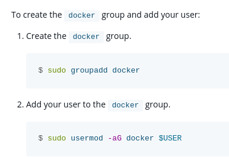

# Lucas vs. Debian & Docker & etc.

De cuando Lucas intentó instalar Docker y Debian decidió que no iba a ir.

## Instalación de Docker

Esto es simple, fué bien, sin problema.

## Vamos a crear el usuario _docker_

Aquí Debian dijo: ª.

Lo primero fué ejecutar `sudo adduser -m docker`, que es lo que indica cualquier guía para crear un usuario con Debian y otras distros y, hasta donde mi memoria llega, es el comando que había ejecutado yo previamente para esas tareas. Pero esta ejecución fallaba y decía lo siguiente: `Unknown option: m`. Viendo la ayuda del comando con `sudo adduser --help` y `man adduser`, pues no estaba la opción `-m`, entonces procedí a crearlo sin la opción a ver si funcionaba.

::: info
En un principio, la opción `-m` en `adduser` indica al comando que cree la carpeta _home_ del usuario en _/home/\<username>_ (o donde se indique con la opción `-D`).
:::

Al ejecutar `sudo adduser docker`, el comando fallaba y devolvía el siguiente error: `adduser: El grupo 'docker' ya existe.`. Y pues claro, mi respuesta inicial fué que yo estaba intentando crear un usuario, no un grupo. Me gustaría poder decir que me di cuenta de que al crear un usuario se creaba un grupo con el mismo nombre, pero eso no sería cierto, sino que mi compañero Iván lo descubrió cuando esto ya estaba solucionado. Básicamente mi solución fue crear un usuario con otro nombre, en este caso hice `sudo adduser dockeruser`, y funcionó.

Ahora procedí a comprobar la existencia de _/home/dockeruser_ y correcto, existía, y los permisos estaban correctamente configurados así que perfecto. Procedo a ver los usuarios que existen con `awk -F: '{ print $1}' /etc/passwd | grep docker` y ¡sorpresa!, no aparece el usuario.

Entonces yo que se me veía muy despierto ese día, vuelvo a buscar por internet y descubro que claro, tenía que asignarle una contraseña al usuario con `sudo passwd dockeruser` y ya estaba todo bien.

::: tip RECOMENDACIÓN

Contraseñas largas para los usuarios por favor y gracias
:::

::: info

Normalmente las herramientas base del sistema de Debian y todas estas distros, GNU utils vamos, no suelen cambiar la API, así que realmente desconozco por completo que ha podido ocurrir con `adduser` para que no me funcionase una opción que se supone que existe.
:::

## Nos queda el grupo

Por si crear el usuario no hubiese sido ya difícil, toca gestionar el añadir el usuario al grupo de Docker. Quiero que veáis lo que pone en la documentación oficial de Docker antes de nada:

Se puede observar que Docker te dice que crees el grupo _docker_. Pues procedo a crear el grupo docker con `sudo groupadd docker` y obtengo lo siguiente (después de entender por qué fallaba lo del usuario, esto tiene lógica): `groupadd: group 'docker' already exists`.

Así que lo dicho, lo que ocurrió es que al **contrario de lo que dice la documentación oficial de Docker**, el grupo _docker_ ya se crea al instalar Docker y por tanto no es necesario crearlo, solo añadir el resultado con `sudo usermod -aG docker dockeruser`.

## Secrets: ¿funcionarán o no?

De cuando los `secret: external: true` no fué
