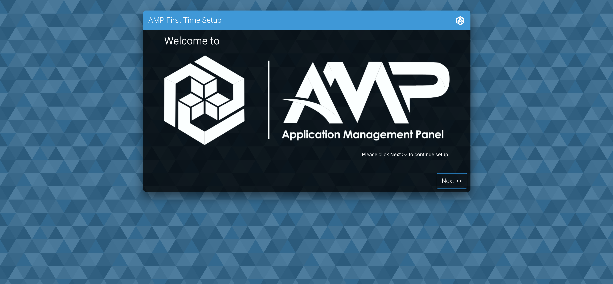
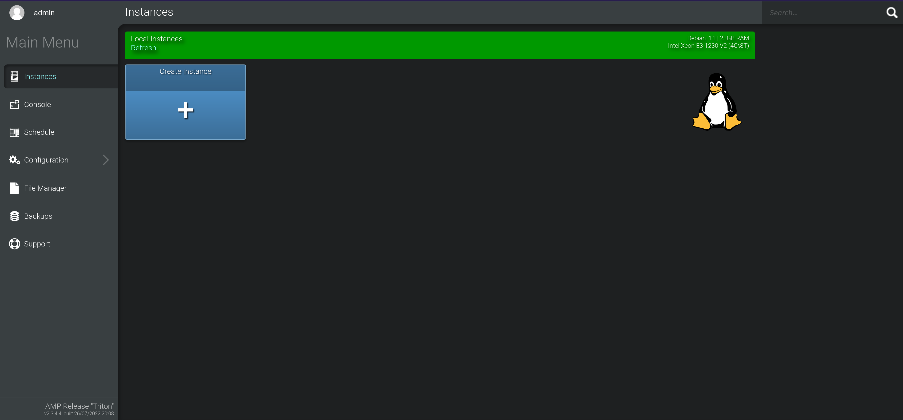
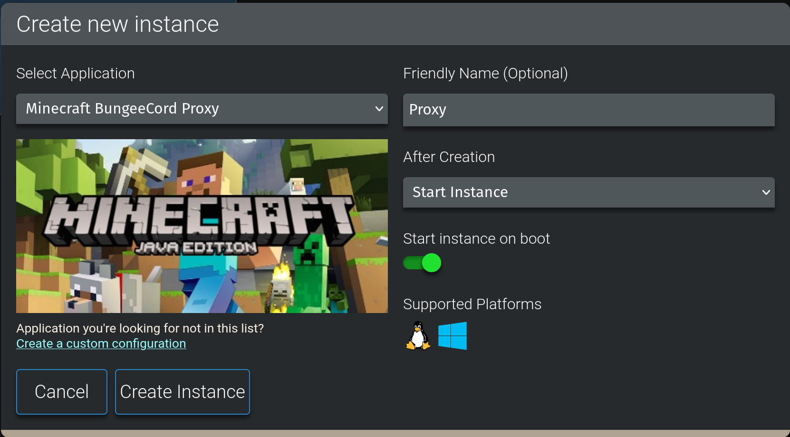
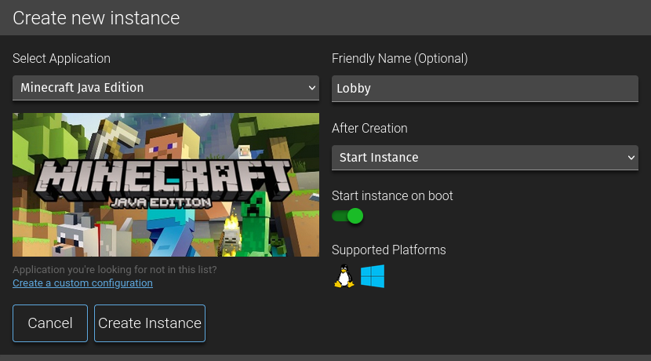

# Minecraft con AMP

Para gestionar un servidor de minecraft con varios tipos de mundos incluyendo minijuegos, las cosas se vuelven más complicadas que simplemente tener un servidor ejecutándose con los plugins, así que usamos un software *(por desgracia de código cerrado)* que nos ayudará a gestionar todos los servidores.



Este software se llama [AMP *(Application Management Panel)*](https://cubecoders.com/AMP) y está desarrrollado por CubeCoders. Lo bueno que tiene es que no solo sirve para gestionar servidores de Minecraft Java Edition, sirve para Bedrock y para bastantes más juegos. Además, la licencia *Professional*, que es la más barata, cuesta unos 10€ y es un pago único, así que está guay.

Dentro de AMP, crearemos los distintos servidores de minecraft, de los que hay que diferenciar dos partes:

- Están los servidores con los distintos mundos o minijuegos. Aquí está lo jugable.
- Y luego está el proxy, que se encarga de conectar todos esos servidores para que los jugadores puedan moverse cómodamente de uno a otro. El proxy es el que se encarga de gestionar la conexión con los jugadores en todo momento.

## Creando la base de datos

Vamos a empezar creando la base de datos de MariaDB que usarán algunos plugins para guardar información de forma global y más estable que en la simple carpeta del servidor.

Desde el usuario `dockeruser`, editamos el `docker-compose.yml` con el contenido:

```yml
version: "3"

services:
  mariadb:
    image: mariadb
    container_name: mariadb
    restart: always
    env_file: mariadb.env
    ports:
      - "3306:3306"
    volumes:
      - /var/lib/mysql:/var/lib/mysql
    command: --transaction-isolation=READ-COMMITTED --log-bin=binlog --binlog-format=ROW
  adminer:
    image: adminer
    container_name: adminer
    restart: always
    ports:
      - "8787:8080"
```

El servicio `adminer` es opcional, pero puede ser una buena opción para visualizar la base de datos desde el navegador. Para conectarnos tendremos que incluir en los parámetros de la conexión SSH `-L 8080:127.0.0.1:8787`, introducir en el navegador `localhost:8080` y los siguientes datos:
- **System:** `MySQL`
- **Server:** `mariadb`
- **Username:** `user`
- **Password:** `passwd`
- **Database:** `minecraft`

Y creamos el archivo `mariadb.env` con:

```dotenv
MARIADB_ROOT_PASSWORD_HASH=hash
MARIADB_USER=mcuser
MARIADB_PASSWORD_HASH=hash
```

Ojo que no hemos puesto las contraseñas, sino su hash (que es lo que MariaDB realmente almacena y necesita) para evitar poner las contraseñas directamente en el archio. Podemos generar el hash desde otra consola de MariaDB escribiendo `SELECT PASSWORD('passwd');` (recomendable) o en [esta web](https://www.browserling.com/tools/mysql-password).

## Instalación de AMP

Lo primero es cambiarnos al usuario `root` y después ejecutar el script de instalación:

```sh
sudo su -l
bash <(wget -qO- getamp.sh)
```

Lo primero que hará es preguntarnos una contraseña para el usuario `amp` del sistema, que será el que contenga todos los archivos de minecraft. Si no introducimos ninguna generará una aleatoria. Como no va a ser necesario acceder a ese usuario manualmente, lo dejamos en blanco.

Ahora hay que elegir un nombre de usuario y una contraseña *(solo con números y letras)* que será para acceder al panel de control y gestionar los servidores. La contraseña debe ser tremenda.

Nos hace una serie de preguntas, cuya respuesta es:

- Sí vamos a tener servidores de Minecraft.
- Aquí depende de si hay interés por crear servidores de otros juegos. Nunca está de más tener las librerías.
- Sí queremos utilizar docker para los servidores.
- Y, si ya hemos [configurado Nginx](../equipo/nginx), sí queremos habilitar HTTPS.

Pulsamos \<Enter\> y so pondrá a instalar AMP. Una vez instalado, tendremos que acceder desde la web para seguir la configuración *(el enlace lo mostrará en la consola)*.

::::info
Si no carga la pantalla de configuración inicial, es decir, nos aparece directamente la pantalla de inicio de sesión, tendremos que acceder al usuario de AMP `sudo su -l amp` y escribir el comando `ampinstmgr resetlogin`, especificar `ADS01` y escribir un usuario y contraseña. Después podremos iniciar sesión en la página y continuar con la configuración inicial.
::::

Desde el navegador, utilizaremos el modo de operación por defecto *(Standalone)*, pondremos la licencia y nos tocará reiniciar AMP con el botón.

**¡OJO!** Si hemos seguido la [configuración de Docker](../equipo/docker), nos dará un error al intentar crear un servidor de minecraft, ya que antes tendremos que añadir al usuario `amp` al grupo `docker` con el comando ejecutado como `root`:

```sh
usermod -a -G docker amp
```

Y seguramente tengamos que hacer un reinicio para que los cambios tengan efecto, después de eso ya no debería de haber problema para crear servidores.



Una vez estamos aquí, vamos a hacer un primer cambio en la configuración, nos vamos a *New Instances Defaults* y marcamos la opción *Exclude new instances from firewall*. Esto hará que los servidores nuevos no se añadan automáticamente al firewall para permitir sus puertos, ya que no necesitaremos que esos puertos estén abiertos al exterior porque la gente se conectará únicamente al proxy, que sí tendremos que permitir, así que escribimos en la terminal:

```sh
sudo ufw allow 25565
```

## Configuración de AMP

AMP ejecuta un servidor SFTP *(SSH File Transfer Protocol)* para poder gestionar los archivos de las instancias de forma más cómoda. Por defecto se ejecuta en el puerto `2223` y nos podemos conectar con el mismo usuario y contraseña que usamos para acceder al panel. Pues bien, para gestionar los archivos, utilizamos [FileZilla](./minio), nos conectamos a `wupp.dev:2223` con usuario y contraseña (añadiendo seguido de la contraseña el código temporal si tenemos habilitada en la cuenta la autenticación en dos pasos) y ya podremos transferir archivos cómodamente entre nuestro ordenador y el servidor.ad

Si queremos cambiar el puerto en el que se ejecuta el servidor SFTP de ADS01, tendremos que editar el archivo `/home/amp/.ampdata/instances.json` y cambiar el puerto dentro de `"DeploymentArgs"`.

Por otro lado, desde la configuración de la página principal podemos ir cambiando cosas como:
- **External Services: *(necesitaremos tener el servidor de correo bien configurado)***
  - SMTP Server Address: `127.0.0.1`
  - SMTP Server Port: `25`
  - SMTP Username: `admin@wupp.dev`
  - SMTP Password: `passwd`
  - Email 'From' address: `admin@wupp.dev`
- **New Instance Defaults:**
  - Exclude new instances from firewall: `True`

Si queremos cambiar la ubicación de las copias de seguridad tendremos que [configurar S3](https://docs.docker.com/) y añadir la siguiente configuración en *New Instance Defaults* (representado como Key: "Value"):
```json
{,
  LocalFileBackupPlugin.Cloud.S3ServiceURL: "http://127.0.0.1:9000",
  LocalFileBackupPlugin.Cloud.S3AuthenticationRegion: "es",
  LocalFileBackupPlugin.Cloud.S3UploadMode: "UploadAllBackups",
}
```

## Configurando el proxy

Ahora vamos a crear el proxy. Utilizaremos [Velocity](https://papermc.io/downloads/velocity), un proxy moderno con gran rendimiento.



Nos toca descargar manualmente la última versión de Velocity *(ahora y cada vez que queramos actualizar)* y moverla a los archivos de la instacia, cosa que deberíamos de poder hacer yendo a *File Manager* y arrastrando el archivo descargado. Si no deja, tocará subirlo utilizando el servidor SFTP y FileZilla.

Nos metemos a gestionar la instancia a *Configuration*, *Server Settings*, en *Server Type* elegimos *Velocity Proxy* y en *Server JAR* elegimos el archivo de Velocity descargado. También vamos a cambiar la versión de Java a la última, en este caso la 18, así que vamos a *Java and Memory* y editamos *Java Version*, vamos también a ajustar la memoria a `2048` MB y añadir las opciones adicionales `-XX:+UseG1GC -XX:G1HeapRegionSize=4M -XX:+UnlockExperimentalVMOptions -XX:+ParallelRefProcEnabled -XX:+AlwaysPreTouch -XX:MaxInlineLevel=15` que vienen en la [documentación de Velocity](https://docs.papermc.io/velocity/tuning#tune-your-startup-flags). Por último, vamos a *Performance and Limits* y desactivamos el *Sleep Mode*, ya que queremos que el proxy siempre esté disponible.

Iniciamos la instancia para generar el archivo de configuración `velocity.toml` y editarlo. Los cambios que nosotros hemos hecho se pueden encontrar en los archivos [del repositorio de GitHub](https://github.com/ComicIvans/server). Un detalle es que, al haber activado [TFO](https://www.geeksforgeeks.org/what-is-tcp-fast-open/), tendremos también que introducir en la consola `sudo sysctl -w net.ipv4.tcp_fastopen=2` para que funcione.

Además, esta es la lista de plugins:

- [Carbon](https://hangar.papermc.io/Vicarious/Carbon)
- [LuckPerms](https://luckperms.net/download)
- [MiniMOTD](https://hangar.papermc.io/jmp/MiniMOTD)
- [MiniPlaceholders](https://hangar.papermc.io/MiniPlaceholders/MiniPlaceholders)
- [SkinsRestorer](https://hangar.papermc.io/SRTeam/SkinsRestorer)
- [SlashHub](https://www.spigotmc.org/resources/%E2%9B%8F%EF%B8%8F-slashhub-%E2%9B%8F%EF%B8%8F-%E2%9C%A8-velocity%E2%9C%A8.101114/)
- [TAB](https://github.com/NEZNAMY/TAB)

Algunos de los plugins utilizan una base de datos, que es la que configuramos en docker anteriormente. Vamos a crear una base de datos para cada plugin que lo necesite.

Empezamos accediendo a la consola de MariaDB desde el usuario de Docker con el comando `docker exec -it db mariadb -u root -p` e introduciendo la contraseña.

Después le damos permisos al usuario que creamos desde `mariadb.env` para editar todas las bases de datos pues no vamos a usar ese contenedor de Docker para otra cosa que no sea Minecraft. Para hacerlo escribimos lo siguiente `GRANT ALL PRIVILEGES ON *.* TO 'mcuser'@'%' WITH GRANT OPTION;` y `FLUSH PRIVILEGES;`.

Pasamos a crear una base de datos por plugin con `CREATE DATABASE minecraft_xx;`, algunos ejemplos pueden ser `minecraft_lp` para LuckPerms o `minecraft_sr` para SkinsRestorer.

## Nota sobre la configuración de los plugins de Minecraft

Configurar los plugins ya sea del proxy o del resto de servidores es una tarea ardua y en ocasiones frustrantes. Debemos revisar toda la documentación para saber los comandos que ofrece el plugin, los permisos que requieren y sus posibilidades de configuración entre otras cosas.

En ocasiones la documentación de los plugins será escasa y no tendrá lo que buscamos. En esos momentos puede ser de utilidad comprobar si hay un servidor de Discord para el plugin, ya que allí es bastante posible que alguna persona haya ido buscando lo mismo que tú.

Concretamente para los mensasjes que muestran los plugins, actualmente nos encontramos dos formatos de escritura:
- El de códigos de color de Minecraft, muy limitado y ya en desuso. Pero como algunos plugins aun lo usan, [aquí](https://codepen.io/0biwan/pen/ggVemP) puedes previsualizar el texto en ese formato.
- [MiniMessage](https://docs.advntr.dev/minimessage/format.html), que es mucho más cómodo y puedes previsualizarlo [aquí](https://webui.advntr.dev/).

Por último, como mención especial a la gestión de permisos, LuckPerms es una maravilla y da muchas facilidades para gestionar permisos. Lee bien la documentación y aprovecha su editor en linea para no querer arrancarte los pelos. Y ten mucho cuidado con los permisos que le das a cada persona, haz una revisión exhaustiva de todo lo que podrán hacer con ellos para luego no llevarte sorpresas de mal gusto.

## El primer servidor

Muy bien, tenemos un proxy y si añadimos el servidor a la pantalla de multijugador de minecraft aparecerá como en línea. Pero si intentamos conectarnos no podremos, porque no tenenemos ningún mundo al que unirnos.

Vamos a crear el primer servidor, que será el que tenga el mundo donde aparezcan los jugadores que se conecten.

Este servidor será el **Lobby**, y desde aquí los jugadores podrán moverse entre los demás servidores.



Dependiendo del tipo de servidor que queramos hacer tendremos que elegir si tener mods o plugins. Lo más común es querer tener plugins, así que vamos a usar Purpur. **¿Por qué Purpur concretamente?** Hay muchas alternativas, pero concreamente [Purpur](https://purpurmc.org/) está basado en [Pufferfish](https://pufferfish.host/downloads), que está basado en [PaperMC](https://papermc.io/), que está basado en [SpigotMC](https://www.spigotmc.org/) pero mejorando notablemente el rendimiento del servidor y arreglando varios bugs. Purpur incluye todas las mejoras de los anteriores y, además, permite configurar un montón de parámetros.

A parte de configurar *Java and Memory* con `4096` MB de límite de memoria, la última version de Java y los argumentos adicionales `-XX:+UseG1GC -XX:+ParallelRefProcEnabled -XX:MaxGCPauseMillis=200 -XX:+UnlockExperimentalVMOptions -XX:+DisableExplicitGC -XX:+AlwaysPreTouch -XX:G1NewSizePercent=30 -XX:G1MaxNewnpmSizePercent=40 -XX:G1HeapRegionSize=8M -XX:G1ReservePercent=20 -XX:G1HeapWastePercent=5 -XX:G1MixedGCCountTarget=4 -XX:InitiatingHeapOccupancyPercent=15 -XX:G1MixedGCLiveThresholdPercent=90 -XX:G1RSetUpdatingPauseTimePercent=5 -XX:SurvivorRatio=32 -XX:+PerfDisableSharedMem -XX:MaxTenuringThreshold=1 -Dusing.aikars.flags=https://mcflags.emc.gs -Daikars.new.flags=true` que se han obtenido de [la documentación](https://docs.papermc.io/paper/aikars-flags), por ahora no voy a documentar el resto de cambios por prisa y pereza.

Para configurar los archivos como `server.properties`, `bukkit.yml`, `pufferfish.yml`, `purpur.yml`, `spigot.yml` y los de la carpeta `config` usamos [esta página](https://purpurmc.org/docs/Configuration/#format), donde vienen las opciones de cada archivo descritas.

Igual que antes, a parte de los cambios escritos a continuación, los archivos modificados están en [el repositorio de GitHub](https://github.com/ComicIvans/server).

Nuevamente, estos argumentos de java aumentan el rendmiento, de servidor y están sacados de [aquí](https://docs.papermc.io/paper/aikars-flags).

Esta es la lista de plugins:

- [DeluxeHub](https://www.spigotmc.org/resources/deluxehub-3-professional-hub-management.49425/)
- [LuckPerms](https://luckperms.net/download)
- [Parkour](https://www.spigotmc.org/resources/parkour.23685/)
- [PlaceholderAPI](https://www.spigotmc.org/resources/placeholderapi.6245/)
- [SkinsRestorer](https://hangar.papermc.io/SRTeam/SkinsRestorer)
- [ViaBackwards](https://hangar.papermc.io/ViaVersion/ViaBackwards)
- [ViaVersion](https://hangar.papermc.io/ViaVersion/ViaVersion)
- [WorldEdit](https://dev.bukkit.org/projects/worldedit)
- [WorldGuard](https://dev.bukkit.org/projects/worldguard)

## Resto de servidores

Esta sección de la documentación es aun más vaga si cabe porque estoy priorizando poner en marcha el servidor. Aun así, no tiene muchas novedades, todo a partir de aquí es buscar plugins y leerse su documentación que obviamente no voy a duplicar aquí.

### Survival Comunitario

Esta es la lista de plugins:

- [Aurelium Skills](https://hangar.papermc.io/Archy/AureliumSkills)
- [Chunky](https://hangar.papermc.io/pop4959/Chunky)
- [CoreProtect](https://hangar.papermc.io/CORE/CoreProtect)
- [Dynmap](https://www.spigotmc.org/resources/dynmap%C2%AE.274/)
- [EssentialsX](https://hangar.papermc.io/EssentialsX/Essentials)
- [Graves](https://www.spigotmc.org/resources/graves.74208/)
- [InteractiveChat](https://hangar.papermc.io/LOOHP/InteractiveChat)
- [Inventory Rollback Plus](https://www.spigotmc.org/resources/inventory-rollback-plus-1-8-1-20-x.85811/)
- [LuckPerms](https://luckperms.net/download)
- [OpenInv](https://dev.bukkit.org/projects/openinv)
- [PlaceholderAPI](https://www.spigotmc.org/resources/placeholderapi.6245/)
- [ProtocolLib](https://hangar.papermc.io/dmulloy2/ProtocolLib)
- [SinglePlayerSleep](https://www.spigotmc.org/resources/singleplayersleep.68139/)
- [SkinsRestorer](https://hangar.papermc.io/SRTeam/SkinsRestorer)
- [Themis](https://www.spigotmc.org/resources/themis-anti-cheat-1-17-1-20-bedrock-support-paper-compatibility-free-optimized.90766/)
- [Vault](https://www.spigotmc.org/resources/vault.34315/)
- [ViaBackwards](https://hangar.papermc.io/ViaVersion/ViaBackwards)
- [ViaVersion](https://hangar.papermc.io/ViaVersion/ViaVersion)
- [WorldEdit](https://dev.bukkit.org/projects/worldedit)
- [WorldGuard](https://dev.bukkit.org/projects/worldguard)

## Más allá

Nuestra intención es gestionar la autenticación de los jugadores de Minecraft con [NamelessMC](https://namelessmc.com/) bajo el subdominio `mc.wupp.dev`.